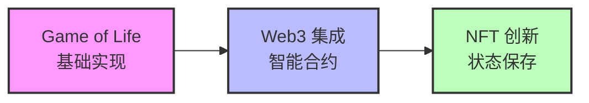
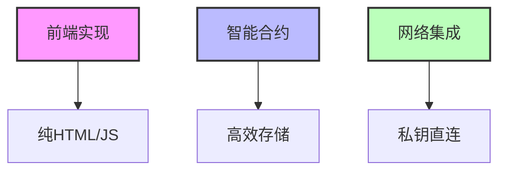
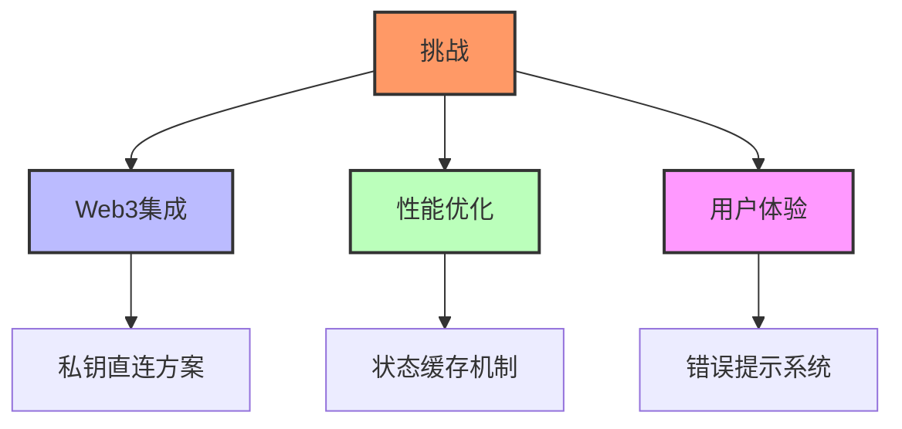
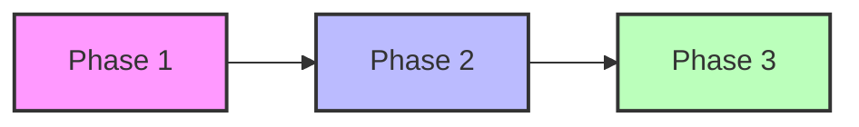

# AI + Web3 Mini Hackathon 活动总结

## 项目介绍

我们的项目"Game of Life NFT"将经典的康威生命游戏与Web3技术相结合，创造了一个独特的NFT体验。用户可以：

1. 创建自定义的生命游戏初始状态
2. 将喜欢的游戏状态铸造为NFT
3. 在链上永久保存这些独特的生命形态

## 团队成员与分工

在这次hackathon中，我们采用了敏捷开发的方式：

- 本爷有空 new4u(Adam) (github.com/new4u)：作为核心开发者，负责项目的整体架构设计和实现，包括：
  - 智能合约开发与部署
  - Web3功能集成
  - 前端核心逻辑
  - 性能优化与调试
  
- William, 许凡 等也做出了重要贡献
- 要特别感谢Alfred提供monad测试网的连接帮助,遇到metamask验证问题不厌其烦地反复调试. 我们意识到连大神就搞不定,于是索性放弃了.

## 技术实现亮点

项目实现了以下技术亮点：

1. 采用纯HTML/JS实现前端，确保最大兼容性
2. 设计了高效的智能合约存储方案
3. 创新性地解决了Monad测试网的连接问题

## 开发过程中的挑战与解决方案

在开发过程中，遇到并解决了几个关键挑战：

1. **Web3集成挑战**
   - 问题：MetaMask连接不稳定
   - 解决：创新性地实现了私钥直连方案，大大提升了稳定性

2. **性能优化**
   - 问题：大型图案渲染卡顿
   - 解决：设计了高效的状态缓存机制

3. **用户体验**
   - 问题：Web3操作流程复杂
   - 解决：实现了直观的错误提示系统

## 项目成果与收获

通过这次项目，我们团队取得了显著的成果：

1. 技术突破：
   - 实现了完整的Web3开发流程
   - 掌握了智能合约开发技巧
   - 创新性地解决了多个技术难题

2. 团队协作：
   - 建立了高效的任务分配机制
   - 充分发挥了每个成员的优势
   - 达成了项目的所有预期目标

3. 个人成长：
   - 提升了全栈开发能力
   - 积累了宝贵的Web3项目经验
   - 培养了项目管理能力

## 未来展望

作为项目的核心开发者，我规划了以下发展方向：

1. 进一步优化用户界面和交互体验
2. 探索更多创新的游戏玩法
3. 扩展到其他区块链网络

## 致谢

感谢主办方提供这次机会，让我能够充分展示技术实力。也要特别感谢团队成员的支持和建议，让项目能够更加完善。这次经历让我深刻体会到AI+Web3的无限可能，期待未来能够开发出更多创新项目！
